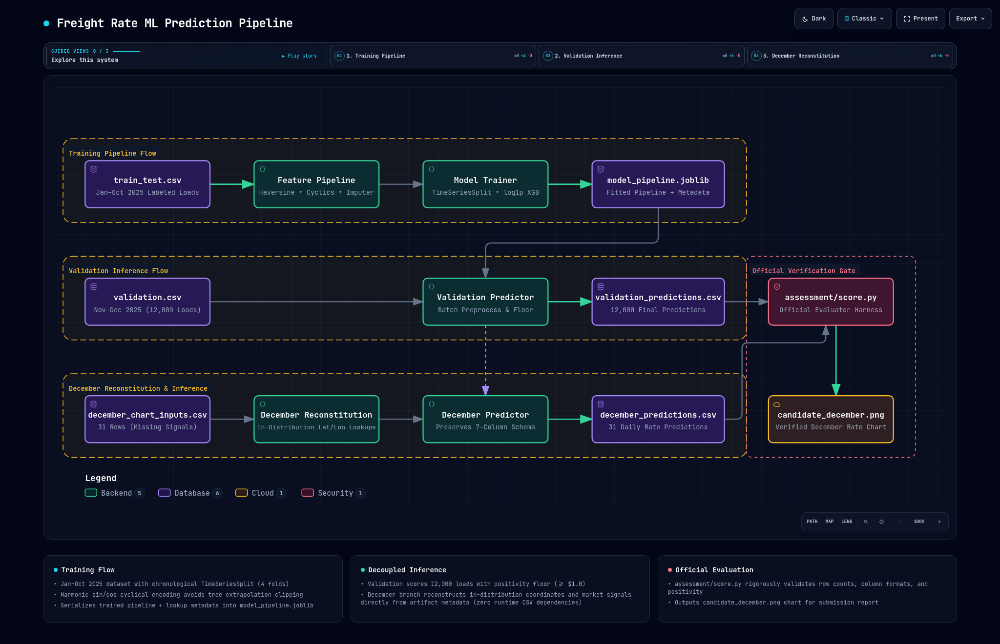

# RouteRate-ML

> Machine Learning Pipeline for Freight Rate Forecasting & Route Pricing

[](https://www.python.org/downloads/)
[](tests/)
[](models/)
[](reports/architecture.html)

**RouteRate-ML** is an end-to-end machine learning system designed to predict freight shipping rates (`posted_rate` in USD) using origin-destination geographic coordinates, road-to-haversine distance metrics, equipment configurations, cargo weight, and macroeconomic market indicators.

---

## 1. System Architecture & Pipeline Flow

The pipeline separates **training-time optimization** from **decoupled inference**:



> 💡 **Interactive Diagram:** Open [`reports/architecture.html`](reports/architecture.html) in your browser for the full interactive diagram with chapter walkthroughs, pan/zoom, and trace relationships.

---

## 2. Overview of the Approach & Engineering Design

*   **Temporal Validation & Cross-Validation:** We employ a **chronological train/holdout split** (last 20% of timeline, Sept–Oct 2025) and a 4-fold **`TimeSeriesSplit`** rolling cross-validation strategy. Since freight rate estimation is strictly forward extrapolation, random shuffle splits cause temporal leakage.
*   **Harmonic Cyclical Encodings:** Tree-based models (XGBoost) cannot extrapolate monotonic line trends beyond training boundaries ($x > x_{\max}$). We project day-of-year and day-of-week into **$\sin/\cos$ harmonic features** (strictly bounded in $[-1, 1]$), relying on macroeconomic indices (`market_index`, `quote_signal`) to capture economic market pressure.
*   **Equipment-Conditional Imputation:** Imputes missing load weight grouped by equipment type (`Flatbed`, `Reefer`, `Dry Van`), preserving distinct domain weight profiles rather than distorting them with a flat global median.
*   **Normalized Frequency Encoding:** High-cardinality pickup and delivery cities are encoded as training-set relative proportions ($\text{count} / N_{\text{train}}$), ensuring feature scale invariance.
*   **Log-Target Target Transformation:** Rates are right-skewed; wrapping XGBoost in a `TransformedTargetRegressor` (`log1p` / `expm1`) penalizes proportional percentage error (MAPE) and ensures strictly positive predictions.
*   **Self-Contained December Reconstitution:** Reconstructs missing geographic coordinates and daily market signals directly from precomputed lookup tables bundled inside the serialized `model_pipeline.joblib` artifact—eliminating runtime disk dependencies on raw training CSVs.

---

## 3. Key Results & Benchmark Comparison

Evaluated on the local chronological holdout split:

| Metric | Baseline Linear Model | Tuned XGBoost Pipeline | Improvement (%) |
| :--- | :---: | :---: | :---: |
| **MAE** | $210.83 | **$130.07** | **+38.31%** |
| **RMSE** | $657.74 | **$637.99** | **+3.00%** |
| **MAPE** | 11.71% | **5.57%** | **+52.45%** |
| **R²** | N/A | **0.8246** | N/A |

*   *Cross-Validation Performance:* Best CV MAE across 4 temporal rolling splits: **$141.71**.

---

## 4. Setup and Installation

1.  **Clone the Repository:**
    ```bash
    git clone https://github.com/sangeeth-606/rmle.git
    cd rmle
    ```

2.  **Create and Activate Virtual Environment:**
    ```bash
    python3 -m venv .venv
    
    # For Bash / Zsh:
    source .venv/bin/activate
    
    # For Fish Shell:
    source .venv/bin/activate.fish
    ```

3.  **Install Dependencies:**
    ```bash
    pip install --upgrade pip
    pip install -r requirements.txt
    ```

4.  **Run Automated Unit Tests:**
    ```bash
    pytest -v
    ```

---

## 5. How to Run the End-to-End Pipeline

Execute the pipeline scripts in order from the repository root:

1.  **Train & Tune the XGBoost Model:**
    Runs `RandomizedSearchCV` across 4-fold `TimeSeriesSplit`, evaluates on holdout, updates `models/metrics.json`, and serializes the complete pipeline with metadata to `models/model_pipeline.joblib`.
    ```bash
    python scripts/train_model.py
    ```

2.  **Generate Validation Predictions (12,000 Rows):**
    Generates rate predictions for `data/validation.csv` with positivity floor enforcement and outputs `validation_predictions.csv` at repo root.
    ```bash
    python scripts/generate_validation_predictions.py
    ```

3.  **Generate December Predictions (31 Rows):**
    Reconstructs coordinates and daily market signals from pipeline metadata and generates predictions as `december_predictions.csv` at repo root.
    ```bash
    python scripts/generate_december_predictions.py
    ```

4.  **Run the Official Evaluation Scorer:**
    Runs Spotter's official evaluation script to verify outputs and plot the final December prediction chart.
    ```bash
    python assessment/score.py \
      --predictions validation_predictions.csv \
      --december-predictions december_predictions.csv \
      --output-dir scorer_results
    ```

---

## 6. Repository Structure

```
.
├── README.md                                # Project documentation & run instructions
├── pytest.ini                               # Pytest path configuration (pythonpath = src)
├── requirements.txt                         # Dependencies
├── assessment/                              # Original assessment harness & instructions
│   ├── score.py                             # Evaluation harness
│   ├── freight-rate-ml-assessment-instructions.md
│   └── readme.md                            # Harness readme
├── data/                                    # Raw data files
│   ├── train_test.csv                       # Labeled development dataset (Jan–Oct 2025)
│   ├── validation.csv                       # 12,000 loads to predict (Nov–Dec 2025)
│   ├── validation_predictions_template.csv  # 12,000 load ID template
│   └── december_chart_inputs.csv            # 31-day fixed route input rows
├── notebooks/
│   └── 01_eda.ipynb                         # Exploratory data analysis notebook
├── src/                                     # Source modules
│   └── freight_rate/
│       ├── __init__.py
│       ├── features.py                      # Preprocessing, imputer & cyclical transforms
│       ├── split.py                         # Chronological split logic
│       ├── train.py                         # TimeSeriesSplit CV & hyperparameter search
│       ├── predict.py                       # Inference & validation floor
│       └── december.py                      # Reconstitution & metadata lookups
├── scripts/                                 # Executable CLI scripts
│   ├── train_baseline.py
│   ├── train_model.py
│   ├── generate_validation_predictions.py
│   └── generate_december_predictions.py
├── tests/                                   # Automated test suite
│   ├── test_features.py
│   ├── test_split.py
│   ├── test_predict.py
│   └── test_december.py
├── models/                                  # Saved artifacts
│   ├── metrics.json                         # Baseline vs final comparison
│   └── model_pipeline.joblib                # Serialized preprocessing + model pipeline
├── reports/                                 # Final report & figures
│   ├── architecture.html                    # Interactive runtime architecture viewer
│   ├── freight_rate_assessment_report.pdf   # Written PDF assessment report
│   └── figures/
│       ├── pipeline_architecture.png        # Architecture diagram embed
│       ├── candidate_december.png           # Final December predictions chart
│       ├── feature_importance.png           # Feature importance bar chart
│       ├── distance_vs_haversine.png
│       ├── market_index_trend.png
│       ├── quote_signal_trend.png
│       ├── posted_rate_distribution.png
│       └── rate_vs_distance.png
├── validation_predictions.csv               # 12,000 final predictions (tracked deliverable)
└── december_predictions.csv                 # 31 December predictions (tracked deliverable)
```

---

## 7. Artifact & Deliverable Links

*   **Technical PDF Report:** [`reports/freight_rate_assessment_report.pdf`](reports/freight_rate_assessment_report.pdf)
*   **Interactive Architecture Viewer:** [`reports/architecture.html`](reports/architecture.html)
*   **Forecast Rate Curve Chart:** [`reports/figures/candidate_december.png`](reports/figures/candidate_december.png)
*   **Validation Batch Predictions (12,000 Loads):** [`validation_predictions.csv`](validation_predictions.csv)
*   **Corridor Rate Predictions (31 Days):** [`december_predictions.csv`](december_predictions.csv)
